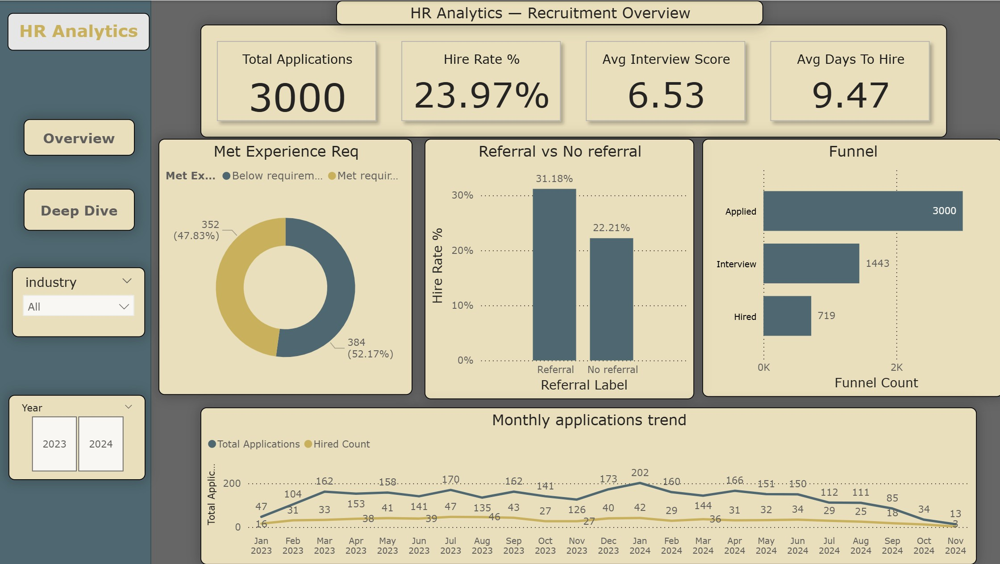

# HR Analytics — Recruitment Performance Project

A full end-to-end HR Analytics project analyzing recruitment data using SQL Server and Power BI.

---

## Project Overview

This project analyzes a synthetic recruitment dataset containing 11,500+ rows across 5 tables.  
The goal is to uncover insights about hiring patterns, candidate success factors, and recruiter performance.

---

## Dataset Structure

| Table | Rows | Description |
|---|---|---|
| candidates | 1,000 | Candidate profiles — age, city, education, experience, LinkedIn score |
| jobs | 150 | Open positions — company, industry, salary range, experience required |
| applications | 3,000 | Who applied to what — status, CV score, referral flag |
| interviews | 2,526 | Interview rounds — score, interviewer, pass/fail |
| skills | 4,909 | Candidate skills and proficiency levels |

---

## Tools & Technologies

- **SQL Server** — Data storage and querying
- **Power BI** — Interactive dashboard with DAX measures
- **DAX** — Custom measures for KPIs and calculations

---

## SQL Queries

All queries are in the `/sql` folder. Each file answers a specific business question:

| File | Business Question | Concepts |
|---|---|---|
| 01_basic_analysis.sql | Candidates per city, experience stats, applications by status | GROUP BY, COUNT, AVG |
| 02_hire_rate_by_industry.sql | Which industries have the highest hire rate? | JOIN, CASE WHEN, ROUND |
| 03_top_candidate_per_city.sql | Who is the top candidate in each city? | RANK() OVER PARTITION BY |
| 04_interview_score_vs_average.sql | How does each score compare to the global average? | AVG() OVER(), Window Function |
| 05_funnel_conversion_rates.sql | What are the conversion rates by industry? | CASE WHEN, NULLIF, FLOAT |
| 06_full_funnel_rounds.sql | How many candidates passed each interview round? | LEFT JOIN, SUM CASE |
| 07_experience_quartiles.sql | Does experience predict hiring success? | CTE, NTILE(), LEFT JOIN |
| 08_gap_analysis.sql | Which jobs had no qualified applicants? | JOIN x3, HAVING, MAX |
| 09_multiple_applications_same_company.sql | Candidates who applied to same company twice | COUNT DISTINCT, DATEDIFF, HAVING |
| 10_monthly_trend_lag.sql | Month-over-month change in hires | CTE, FORMAT, LAG(), NULLIF |

---

## Key Insights

- Referral candidates are hired at **31%** vs **22%** without referral
- **48%** of rejected candidates actually met all experience requirements — competition, not skills gap, is the main rejection driver
- PhD holders are hired at **34%** vs **18%** for high school graduates
- Banking industry has both the **slowest hiring process** and the **lowest hire rate**
- Center region has **5x more applications** than the South
- Top interviewer passes **73.9%** of candidates vs **66.8%** for the lowest

---

## Dashboard

The Power BI dashboard consists of 2 pages with page navigation and synchronized slicers (Industry + Year).

**Page 1 — Overview**
- 4 KPI Cards: Total Applications, Hire Rate %, Avg Interview Score, Avg Days to Hire
- Referral vs No Referral comparison
- Met Experience Requirement breakdown (rejected candidates)
- Recruitment Funnel: Applied (3,000) → Interview (1,443) → Hired (719)
- Monthly Applications & Hires Trend (dual line chart)

**Page 2 — Candidate & Process Analysis**
- Interviewer Pass Rate table
- Applications by Region (Center / North / Jerusalem / South)
- Hire Rate by Education Level
- Scatter Plot: Avg Days to Hire vs Hire Rate by Industry

The Power BI dashboard consists of 2 interactive pages with built-in page navigation and synchronized slicers (Industry and Year) to allow seamless filtering.

### Page 1 — Overview
This page provides a high-level summary of recruitment volumes, processing speeds, and top-funnel efficiency metrics:
- **Total Applications:** Displays the total number of job applications submitted in the system.
- **Hire Rate %:** Calculates the percentage of total applications that successfully resulted in a hire.
- **Avg Interview Score:** Shows the overall average interview score across all candidates.
- **Avg Days to Hire:** Measures the average number of days that pass from the initial application date to the final hiring date.
- **Referral vs No Referral:** Compares the successful hiring rates between candidates who came through a "Bring a Friend" recommendation versus those who applied independently.
- **Met Experience Req:** Analyzes rejected candidates to show how many actually met all the experience requirements. This provides a critical insight proving that heavy market competition, rather than a skills gap, is the main driver of rejections.
- **Recruitment Funnel:** Visualizes the entire candidate journey from application, through the interview stage, to the final hire, showing exact candidate volumes at each step.
- **Monthly Trend:** Features a dual-line chart plotting monthly application volume against the absolute number of hires, helping stakeholders identify seasonal patterns and trends over time.

### Page 2 — Candidate & Process Analysis
This page drills down into operational efficiency, geographical trends, and candidate demographics:
- **Interviewer Pass Rate:** Displays a matrix table of each interviewer's individual pass rate alongside their average assigned score, making it easy to detect interviewer alignment or bias.
- **Count by Region:** Illustrates the geographic distribution of applicants across major regions (Center, North, Jerusalem, and South).
- **Hire Rate by Education:** Shows the successful hiring rate breakdown based on the candidates' highest level of education (from High School to PhD).
- **Avg Days to Hire by Industry (Scatter Plot):** Plots each industry as a distinct data point where the X-axis represents hiring speed and the Y-axis represents the hiring success rate. This allows stakeholders to instantly identify which industries are fast and efficient versus those that are slow with low placement rates.

  



---

## DAX Measures

```dax
Hire Rate % = DIVIDE([Hired Count], [Total Applications], 0) * 100

Hired Count = CALCULATE(COUNTROWS(applications), applications[status] = "hired")

Avg Days To Hire = AVERAGEX(
    FILTER(interviews, interviews[round] = 1),
    DATEDIFF(RELATED(applications[apply_date]), interviews[interview_date], DAY)
)

Interviewer Pass Rate % = DIVIDE(
    CALCULATE(COUNTROWS(interviews), interviews[passed] = TRUE()),
    COUNTROWS(interviews), 0
) * 100

Funnel Applied = CALCULATE(COUNTROWS(applications), ALL(applications[status]))

Funnel Interview = CALCULATE(
    COUNTROWS(applications),
    ALL(FunnelStages),
    applications[status] IN {"interview", "hired"}
)
```

---

## Project Structure

```
hr-analytics/
│
├── sql/
│   ├── 01_basic_analysis.sql
│   ├── 02_hire_rate_by_industry.sql
│   ├── 03_top_candidate_per_city.sql
│   ├── 04_interview_score_vs_average.sql
│   ├── 05_funnel_conversion_rates.sql
│   ├── 06_full_funnel_rounds.sql
│   ├── 07_experience_quartiles.sql
│   ├── 08_gap_analysis.sql
│   ├── 09_multiple_applications_same_company.sql
│   └── 10_monthly_trend_lag.sql
│
├── screenshots/
│   ├── overview.png
│   └── deepdive.png
│
├── HR_Analytics_Theme.json
└── README.md
```

---

## Contact

Feel free to connect on LinkedIn if you have any questions about this project.
